# ComputerVision
Samples for Computer Vision, Machine Learning, Curve Fitting, Image Segmentation and Stitching, Clustering
## HW 1
Matlab basics and principle component analysis (pca)
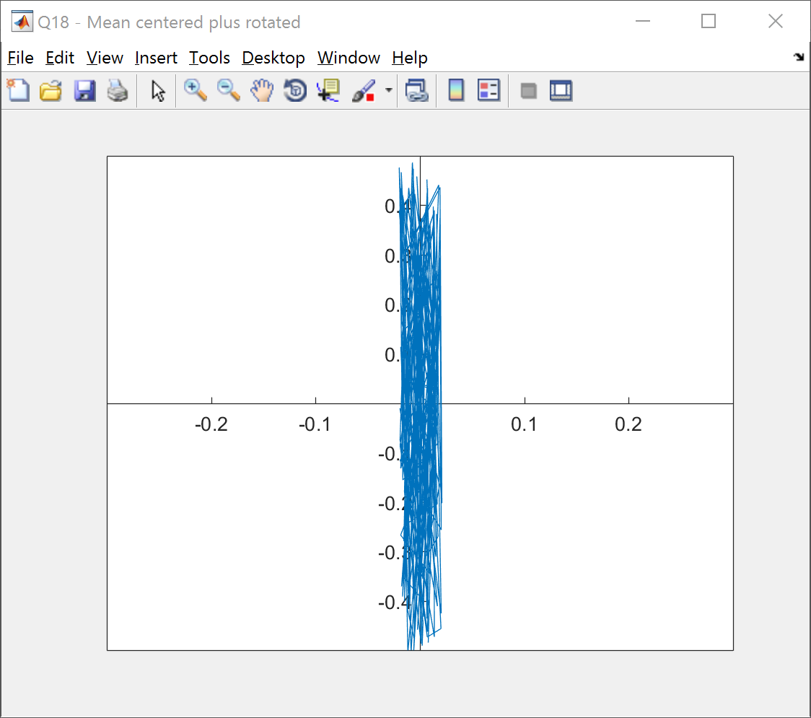
## HW 2
Measuring camera sensor sensitivites
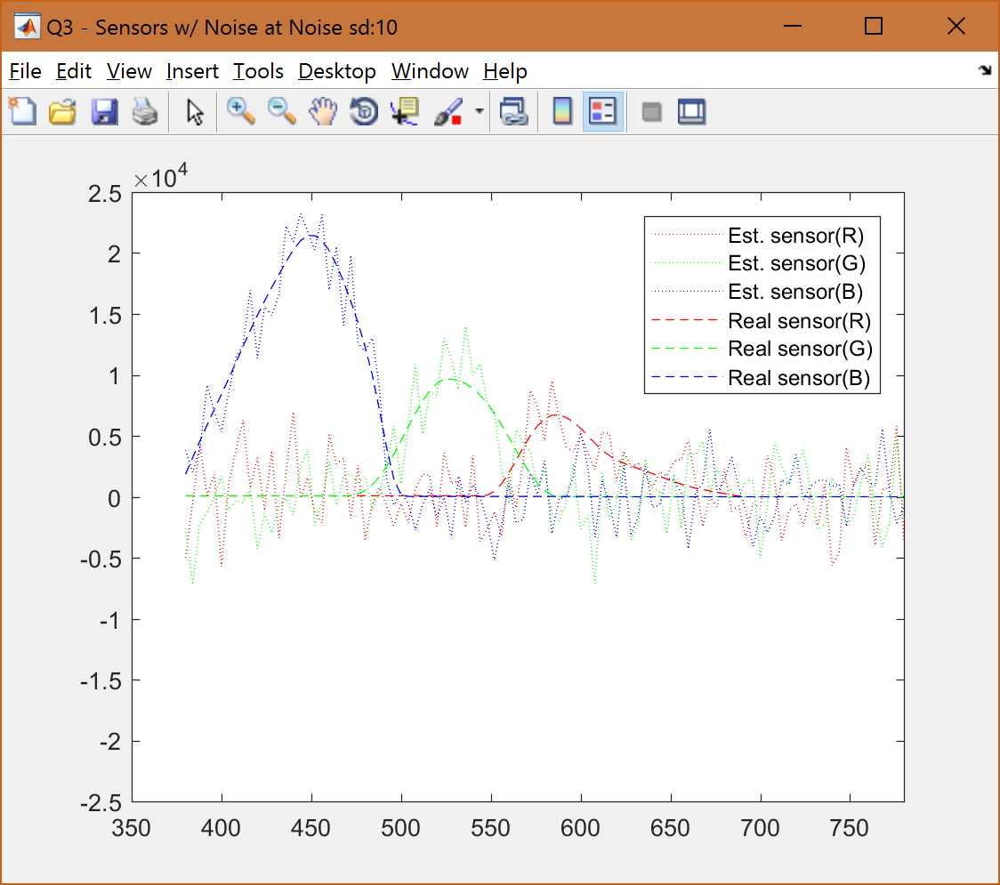
## HW 3
Line fitting using homogeneous and non-homogeneous linear least squares
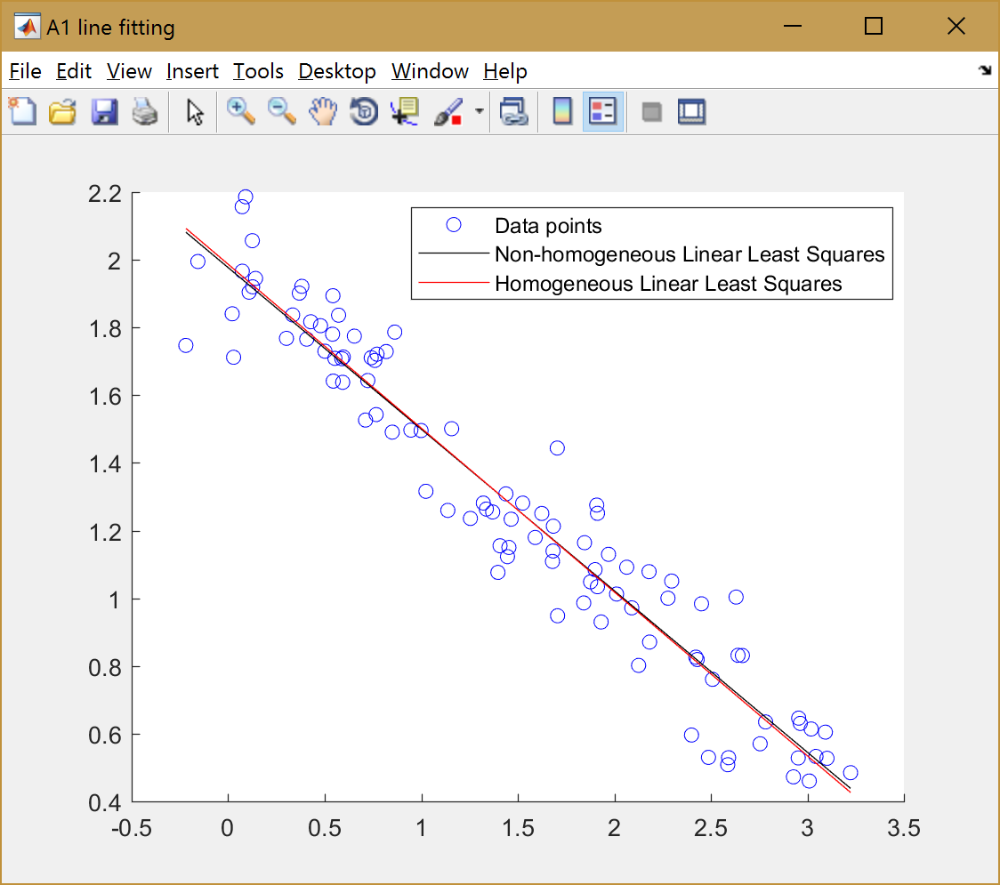
## HW 4
Image points re-projection using given & calculated camera matrix
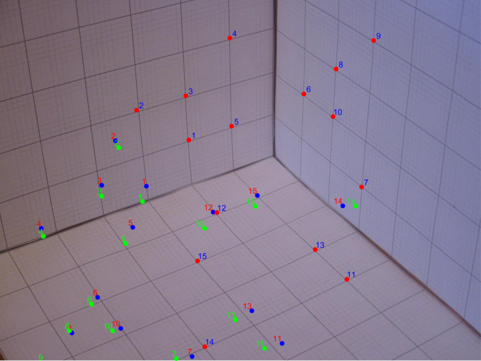
## HW 6
Calculating surface shape (depth) from shading
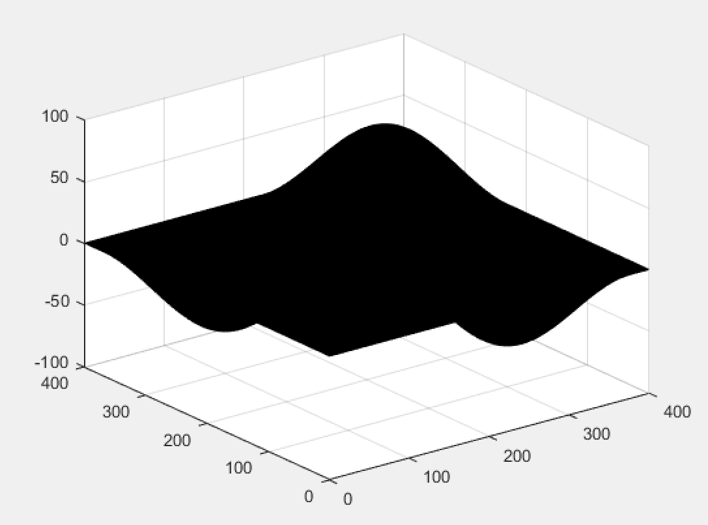
## HW 7
Color correction using color constancy
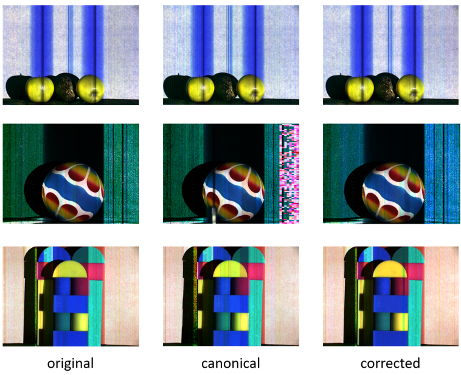
## HW 8
Edge detection and linking
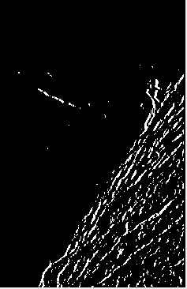
## HW 9
Edge matching
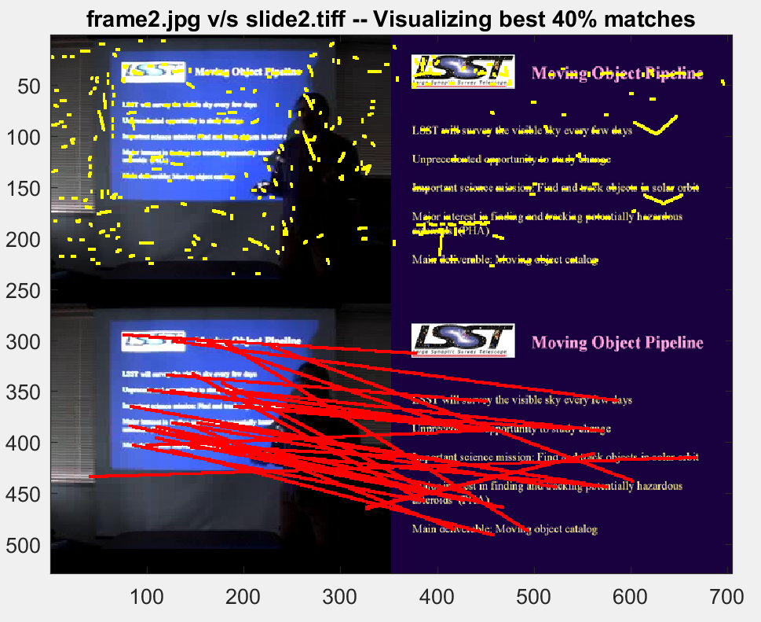
Corner detection using Harris algorithm
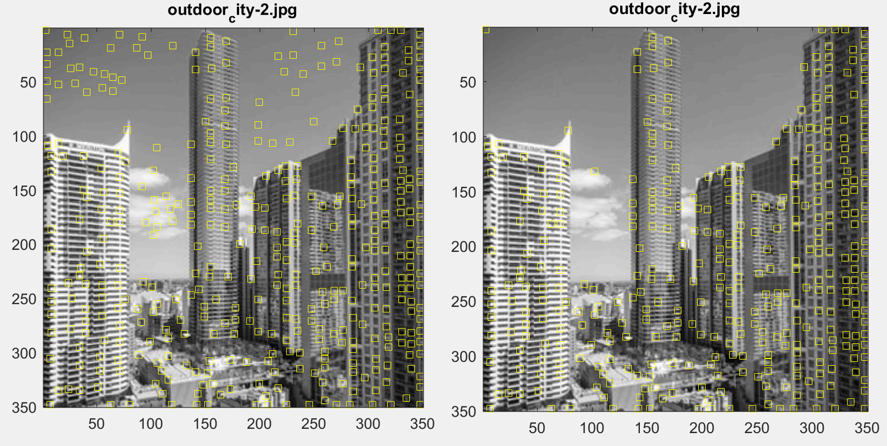
## HW 10
Image segmentation
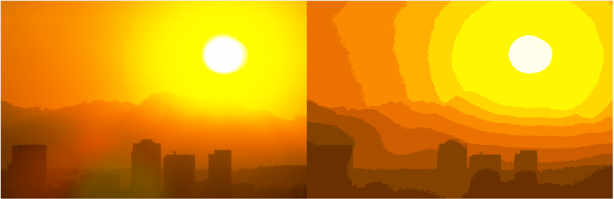
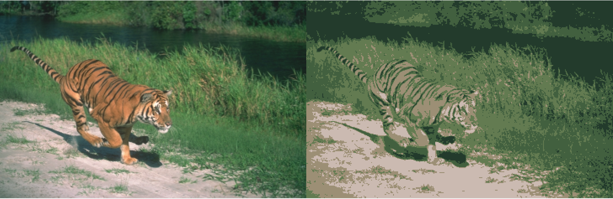
## HW 11
Image stitching using homography estimation
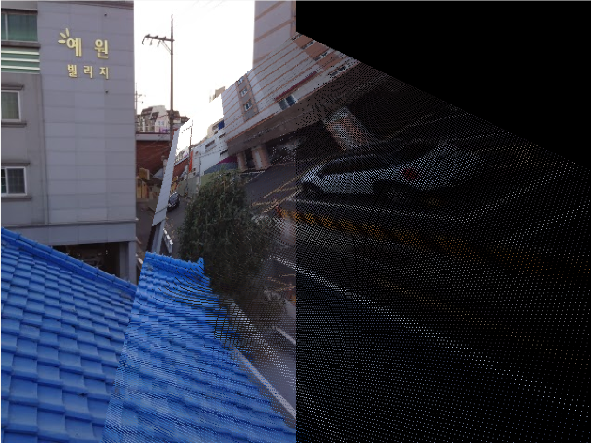
